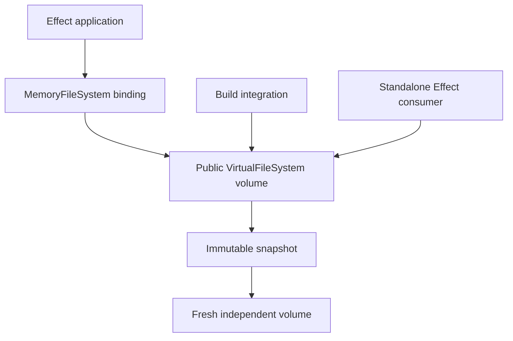

# A public VirtualFileSystem for Effect

Introduce a standalone filesystem backend with defined POSIX semantics, immutable snapshots, and a MemoryFileSystem binding that preserves the existing Effect contract.

6 September 2026 · Proposed scope · Not yet implemented

- **Approval requested** — Scope, compatibility promises, and design consequences.
- **This PR** — Backend, Effect binding, fixtures, snapshot save/load, and a virtual-build acceptance test.
- **Follow-ups** — Mounting, overlay, and host-directory import/export.

## The backend becomes independently useful

The goal is to let an application, build integration, or future host binding use the same filesystem instance without going through `MemoryFileSystem`. The backend owns filesystem behavior; `MemoryFileSystem` adapts it to Effect's existing `FileSystem` service.

This proposal consolidates the agreed direction for maintainer approval. It defines intended behavior and boundaries, not implementation steps, final TypeScript signatures, package placement, or a release schedule.

*Multiple consumers can share one live volume. A snapshot creates an independent starting point without exposing internal storage.*

Standalone means independent of `MemoryFileSystem`, not independent of Effect. Operations remain Effect values, with typed errors and scoped resources. The backend should remain usable in Node, browsers, and workers without requiring host filesystem access.

## POSIX semantics for an explicit filesystem subset

> **Proposed compatibility statement**
>
> `VirtualFileSystem` implements documented POSIX.1-2024 semantics for regular files, directories, symbolic links, and hard links, covering supported path, permission, metadata, and file-handle operations. Unsupported operations and implementation limits are explicit.

This is a bounded filesystem claim. It is not full POSIX conformance, certification, a replacement C API, or a promise that arbitrary native software can run against the volume. Excluding operations means we must publish the supported profile rather than describe the module simply as “fully POSIX compliant”.

**Behavior included in this PR**

| Area | Commitment | Consequence |
| --- | --- | --- |
| Files and namespace | Regular files, directories, symlinks, hard links, creation, rename, unlink, and directory removal. | Names and underlying file identity are distinct. Open files survive rename and unlink until their handles close. |
| Path resolution | Relative paths, directory-relative operations, component-by-component symlink traversal, dot/dot-dot, and trailing-separator rules. | Path normalization cannot replace filesystem lookup. Permissions apply during traversal. |
| Handles and I/O | Access modes, exclusive creation, append, truncation, scoped and explicit close, POSIX offsets, positional reads/writes, seeking, EOF, and zero-filled gaps. | The backend has a richer contract than today's Effect file handle. Sparse storage optimization is not required initially. |
| Metadata | File identity, link count, owner/group, modes, timestamps, and both target-following and own-link metadata. | Consumers can inspect dangling links and distinguish status-change time from content-modification time. |
| Permissions | Explicit credentials, owner/group/other checks, directory search permission, creation mask, and applicable namespace permission rules. | Permission metadata has behavioral meaning. A privileged default keeps fixtures and builds convenient. |
| Errors | Typed, distinguishable filesystem failures, mapped separately into `PlatformError`. | A future binding can distinguish missing entries, wrong file kinds, invalid handles, denied access, and exhausted capacity. |

The specification defines these behaviors across several interfaces, including [open and creation](https://pubs.opengroup.org/onlinepubs/9799919799/functions/open.html), [pathname resolution](https://pubs.opengroup.org/onlinepubs/9799919799/basedefs/V1_chap04.html#tag_04_16), and [seeking](https://pubs.opengroup.org/onlinepubs/9799919799/functions/lseek.html). The final profile must enumerate supported operations, applicable requirements, permitted alternatives, and limits. Broad categories in this proposal are not themselves a completed conformance ledger.

### Effect supplies execution and resource management

Use typed failures instead of global `errno`, and Effect scopes for cleanup. A fiber is not a simulated POSIX process. Process creation, executable loading, signals, terminals, and process memory mapping remain outside the backend. Future host integrations may rely on the operating system for those facilities.

## A volume is shared; caller state is separate

A volume is one live filesystem instance. Its public API exposes operations and opaque handles, not inode maps or mutable storage buffers. This keeps storage representation replaceable.

**Where state belongs**

| Owner | State | Rule |
| --- | --- | --- |
| Volume | Namespace, inode identity, contents, metadata, limits, and mutation coordination. | Consumers bound to the same volume observe the same committed files. |
| Caller context | Credentials, supplementary groups, working directory, and umask. | One consumer's context does not change another's. Derive a context for a different working directory. |
| Open handle | Access mode, position, and lifetime. | Separate opens have independent positions. Closing one handle does not close another. |

The default working directory is the volume root. Working directories retain directory identity across rename. This PR has one volume root; restricted caller roots and subtree confinement are deferred.

Permission checks use explicit caller identity, with a convenient privileged default. The umask controls permissions on newly created entries; it does not rewrite existing files. Defaults must be documented and independent of the host process.

**Security boundary:** these checks govern calls through the filesystem API. They do not sandbox arbitrary JavaScript or prevent code from using a more privileged context it already possesses.

Descriptor duplication is deferred. Its eventual shared-offset behavior should remain possible, but no `dup` support is promised in this PR.

## Preserve Effect compatibility without weakening the backend

`MemoryFileSystem` keeps its existing `FileSystem` behavior and string-based interface. It can bind an existing public volume, with a convenience path for creating a fresh one. Multiple bindings can share a volume without sharing open handles.

The backend follows POSIX offsets. The binding preserves Effect's current cursor semantics. These are deliberately different contracts and need separate tests.

**Examples that require adaptation**

| Operation | Backend contract | Existing Effect binding |
| --- | --- | --- |
| Shrink a file below its offset | Preserve the offset. | Preserve the existing cursor-clamping behavior. |
| Append through a handle | Advance the offset to the end of the written bytes. | Preserve the existing separate read-cursor behavior. |

The exploratory tests exposed these differences; they are not merely missing backend features. The existing shared adapter suite explicitly expects the Effect behavior. Preserving it avoids introducing an unrelated behavior change for existing consumers.

### Preserve filename bytes in the backend

The backend preserves filename bytes and provides convenient string APIs. This avoids a Unicode-only restriction that would prevent faithful representation of some host filenames. It also makes name comparison, validation, and snapshot encoding more involved.

The string adapter cannot faithfully express every byte sequence. Its behavior for unrepresentable names still needs a precise rule before API release; it must not silently merge distinct names through lossy decoding. Byte-preserving storage does not expand the existing string interface's capabilities automatically.

### Prove a virtual module build, not an entire virtual toolchain

The acceptance test creates an entry module and relative dependency in a standalone volume, bundles them through a Vite/Rolldown integration without copying source files to disk, modifies the dependency, and verifies changed output after rebuilding.

[Vite's resolveId and load hooks](https://vite.dev/guide/api-plugin) provide the integration route. This does not redirect native filesystem calls in arbitrary plugins or promise fully virtual configuration discovery, package resolution, assets, and build output. A production plugin package is not required by this proposal; the integration test must demonstrate the public backend is sufficient.

## Save filesystem state and load an independent volume

This PR includes fixture creation, immutable snapshots, a versioned encoding, decoding, and loading a fresh volume. Saving encoded snapshot data through a chosen storage service is in scope. Exporting a tree of ordinary host files is not.

1. Create a volume from a fixture or normal filesystem operations.
2. Capture a consistent, immutable snapshot.
3. Encode it and write the data using a host filesystem or other storage service.
4. Read and validate the data later, then construct a fresh volume.

Host I/O stays outside the backend. The same snapshot can be stored in a file, browser storage, or a database. The proposal commits to portable snapshot data, not integrations with each storage provider.

**Persistent state versus live runtime state**

| Preserved | Excluded |
| --- | --- |
| File bytes, directory structure, and byte-preserving names. | Open handles, offsets, and unlinked files retained only by open handles. |
| Hard-link relationships and raw symlink targets, including dangling links. | Watch subscriptions, active locks, and runtime closures. |
| Ownership, permission metadata, supported timestamps, and format information needed to interpret the state. | Caller credentials, working directories, and Effect runtime objects. |

If two names reference one file, restoring them must recreate that relationship rather than two independent copies. Whether numeric inode identifiers themselves survive a restore remains a format detail to settle; shared identity within the restored volume is required.

### Copy bytes initially to guarantee isolation

Snapshot capture initially copies file bytes. The snapshot does not change when the live volume is overwritten, renamed, or deleted. Loading it twice produces independent volumes.

**Cost:** capture takes time and additional memory proportional to stored content. Snapshot capture must coordinate with mutations, so large captures can delay writers. Cheap branching and copy-on-write storage are not part of the first-release promise.

A rename concurrent with capture must appear entirely before or after it. Load validates the image before exposing a volume, including structural references, supported versions, and resource limits. Loading replaces no existing volume, avoiding ambiguous effects on live handles and watchers.

### Persistence is not crash durability

A saved snapshot can reconstruct the filesystem. It does not make each write durable or promise that a snapshot save survives a crash. Atomic file replacement and durable host flushing depend on the storage operation. The in-memory backend must document volatile synchronization behavior rather than imply durable `fsync`.

The snapshot format is versioned from its first release. Versioning permits detection and future migration; it is not a promise to decode all future formats. The exact encoding and evolution policy remain to be specified.

## Make limits and concurrent behavior explicit

**Configurable capacity**

Support configurable stored-byte and entry-count limits, with documented defaults and predictable capacity errors. These are logical filesystem limits, not a measurement or hard bound on JavaScript heap use.

**Precise failures**

Keep backend error distinctions intact. The Effect binding translates them into the established `PlatformError` contract. Do not reconstruct errors from description strings.

**Operation boundaries**

Individual namespace mutations and snapshot capture have defined atomic boundaries. A multi-operation sequence is not a transaction. I/O transfer counts and any permitted partial results must be explicit.

**Cancellation**

For an atomic mutation, interruption before commit leaves state unchanged; after commit, completion must not imply rollback. Cancellation and any partial I/O results need documented behavior consistent with the supported operation.

Numeric defaults, filename/path limits, timestamp precision, and accounting rules still need to be written down. Hard-link aliases should not accidentally turn a “stored bytes” limit into an unexplained per-path charge. These are remaining contract details, not additional product features.

## Keep the next steps outside this PR's claims

**Explicit exclusions**

| Deferred feature | What it would add | Consequence now |
| --- | --- | --- |
| FUSE and other host mounts | A native path backed by the live volume. | No claim that Vim or arbitrary native programs can access this volume directly. |
| WebDAV and NFS | Separate network protocol bindings. | No network filesystem compatibility promise. |
| Overlay | A writable layer over an existing tree, with copy-up and deletion records. | Independent copies are available; shared lower layers and cheap isolated branches are not. |
| Host-directory import/export | Transfer ordinary files between a real directory and a volume. | Save/load uses the encoded snapshot format, not a normal host directory tree. |
| Advisory locks | Application-visible locking with defined ownership. | No compatibility claim for software dependent on record locks. Internal mutation coordination is not a substitute. |
| FIFOs, device files, and filesystem sockets | Special-file behavior and named communication. | The supported file kinds remain regular files, directories, and symlinks. |
| Descriptor duplication and restricted roots | Shared-offset duplicates and caller-specific root boundaries. | No duplicated-descriptor or subtree-confinement guarantee. |
| Optimized storage and durable commits | Copy-on-write blocks, allocation controls, or crash-safe persistence. | Correctness comes first; large snapshots and sparse files may be costly. |

Overlay requires merged lookups, hidden lower entries, and copy-up rules, as illustrated by [Linux's OverlayFS documentation](https://docs.kernel.org/filesystems/overlayfs.html). These policies are separate from POSIX and snapshot round-tripping. Mount bindings likewise have their own lifecycle and request contract; see [libfuse's operation interface](https://libfuse.github.io/doxygen/structfuse__operations.html).

## Approve the bounded contract and its consequences

Approval means proceeding with the public backend, preserved Effect binding, caller model, byte-preserving names, fixture and snapshot lifecycle, configurable limits, and bounded virtual-build demonstration described here. It does not approve final API signatures or imply the implementation already satisfies the claims.

### Evidence required before claiming completion

- A documented supported POSIX profile with executable behavior tests and explicit exclusions.
- The existing shared Effect filesystem contract passing through MemoryFileSystem.
- Two consumers observing one volume without sharing caller state or handle positions.
- Snapshot isolation, validation, and round-trip tests preserving bytes, metadata, names, and hard-link relationships.
- The standalone virtual module bundle and rebuild acceptance test.

### What remains open within this scope

Final operation and handle types; exact flags and profile limits; unrepresentable-name behavior in the string adapter; numeric defaults and capacity accounting; snapshot encoding, identifier policy, and version evolution. These details require explicit contracts before release. None should silently weaken the compatibility statement.

The proposal favors a wider public backend over expanding the existing platform abstraction to cover every need. It accepts adaptation code, snapshot copying costs, and a richer permission model in exchange for standalone use and future bindings. Revisit the scope if a required consumer needs locks, special files, full-project virtualization, or inexpensive branching before those follow-ups exist.

### Exploratory evidence and source limitations

The earlier exploration in this workspace recorded 15 POSIX probes: 11 passed and four failed at the intended assertions. The four differences concerned truncation offsets, append offsets, negative seeks, and closed-handle seeks. The final exploratory run reported 100 passes, four expected failures, and 28 TODOs after enabling the shared adapter suite. These are prior exploration results, not a new validation run for this document or completed backend conformance.

The 28 TODOs predate the scope decisions in this proposal and include deferred work. They are not the approval checklist. No mount, full build integration, or snapshot implementation was demonstrated by that exploration.

Reference target: POSIX.1-2024, Issue 8. Some Open Group pages returned HTTP 403 during research. The unchanged truncation-offset rule was corroborated with the [Linux man-pages truncate documentation](https://man7.org/linux/man-pages/man2/truncate.2.html); the final conformance ledger still requires clause-level verification. This document establishes intended scope rather than asserting an exhaustive standards audit.

