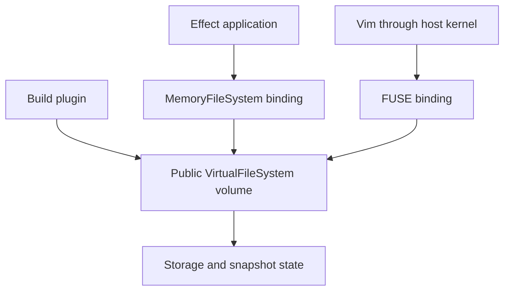

# VirtualFileSystem exploration

Research date: 2026-09-06. Source checkout: `e0cef2089b`.

The existing inode model is a useful starting point, but extracting it unchanged would expose Effect's adapter semantics as the backend contract. Design a public `VirtualFileSystem` with its own operations, then make `MemoryFileSystem` bind a volume into `FileSystem.FileSystem`.

This exploration adds tests and records decisions. It does not implement the new backend or claim complete POSIX conformance.

## Acceptance criteria and present evidence

| Acceptance criterion            | Current state                                                                                                                                      | Evidence needed to accept it                                                                                                                                           |
| ------------------------------- | -------------------------------------------------------------------------------------------------------------------------------------------------- | ---------------------------------------------------------------------------------------------------------------------------------------------------------------------- |
| Full POSIX filesystem           | Partial regular-file, directory, and link behavior. Four executable probes expose adapter differences. Many system interfaces cannot be expressed. | Agree a POSIX edition, option groups, supported file kinds, limits, and division between backend and host kernel. Map each applicable normative requirement to a test. |
| Usable by Vim                   | No mount binding exists in this implementation. A JS service cannot redirect an unrelated native process's filesystem calls.                       | Mount a volume, run real Vim with swap and backup behavior enabled, save, inspect backend bytes and metadata, and unmount cleanly.                                     |
| Usable without MemoryFileSystem | Public `make` returns only `FileSystem.FileSystem`. `Volume`, state, and operations are private.                                                   | Construct a public volume directly and bind two independent consumers to the same instance.                                                                            |
| Fixtures and persistence        | No public fixture, snapshot, restore, or host export API.                                                                                          | Round-trip contents, metadata, symlink targets, and hard-link topology; validate malformed input and snapshot isolation.                                               |
| Overlay                         | No lower/upper lookup or deletion records.                                                                                                         | Copy-up, merged directories, persistent deletion markers, opaque directories, and a documented identity policy.                                                        |

“Full POSIX” needs a filesystem profile. POSIX also specifies processes, signals, terminals, networking, shell utilities, and a C programming environment. A TypeScript filesystem backend cannot provide all of that by itself. Specify filesystem semantics from POSIX.1-2024, identify optional requirements, and assign host responsibilities explicitly. Do not silently redefine full POSIX to mean the methods already present on `FileSystem`.

## What the tests establish

`packages/effect/test/MemoryFileSystem.posix.test.ts` contains 15 probes. Each creates a fresh volume. The first run used ordinary assertions throughout and produced **11 passes and 4 failures**. The four failures now use `it.effect.fails`; an unexpected pass requires removing that marker. They remain unmet requirements even when Vitest reports a green run.

| Probe                                       | Observed | Interpretation                                                                                                                     |
| ------------------------------------------- | -------- | ---------------------------------------------------------------------------------------------------------------------------------- |
| Resolve symlink before `..`                 | Pass     | Resolution follows filesystem entries rather than lexically collapsing the path.                                                   |
| Reject `/file/`, `/file/.`, `/file/../file` | 3 passes | A regular file cannot be traversed as a directory. Exact POSIX errno is not asserted.                                              |
| Competing exclusive creations               | Pass     | One caller succeeds and the other receives `AlreadyExists`. This is a bounded concurrency example, not a proof over all schedules. |
| Independent opens                           | Pass     | Separate handles have separate offsets.                                                                                            |
| Append across two handles                   | Pass     | Writes append at the current EOF even after seeking.                                                                               |
| Seek past EOF, then write                   | Pass     | Seek alone does not grow the file; the later write fills the gap with zero bytes.                                                  |
| Unlink, recreate name, use old handle       | Pass     | The old inode remains usable with zero links; recreation gets another inode.                                                       |
| Rename over an open destination             | Pass     | The replaced destination remains readable through its old handle.                                                                  |
| Rejected directory replacement              | Pass     | Both trees retain their contents.                                                                                                  |
| Shrink below the current offset             | Fail     | Offset becomes `2`, expected `6`.                                                                                                  |
| Write in append mode                        | Fail     | Offset remains `0`, expected `4`.                                                                                                  |
| Seek to a negative resulting offset         | Fail     | Operation succeeds rather than rejecting it.                                                                                       |
| Seek on a closed handle                     | Fail     | Operation succeeds rather than reporting a bad descriptor.                                                                         |

The first two failing behaviors are also deliberately tested by `FileSystemTest.ts` under “should preserve the read cursor when appending through a handle” and “should preserve or clamp a file-handle cursor based on the truncated length”. `packages/platform/node-shared/src/NodeFileSystem.ts` implements them using its own cursor. Native Node backing does not make that cursor a POSIX open-file offset.

The POSIX references are [pathname resolution](https://pubs.opengroup.org/onlinepubs/9799919799/basedefs/V1_chap04.html#tag_04_16), [open](https://pubs.opengroup.org/onlinepubs/9799919799/functions/open.html), [lseek](https://pubs.opengroup.org/onlinepubs/9799919799/functions/lseek.html), [rename](https://pubs.opengroup.org/onlinepubs/9799919799/functions/rename.html), [unlink](https://pubs.opengroup.org/onlinepubs/9699919799/functions/unlink.html), and [write](https://pubs.opengroup.org/onlinepubs/9699919799/functions/write.html). The latter two retrieved pages are Issue 7. The target suite edition is Issue 8; verify those clauses against that edition before treating the inventory as complete.

Direct retrieval of several Open Group pages returned HTTP 403. The [Issue 8 ftruncate reference](https://pubs.opengroup.org/onlinepubs/9799919799/functions/ftruncate.html) remains the normative target; the unchanged-offset rule was corroborated using the [Linux man-pages project's truncate documentation](https://man7.org/linux/man-pages/man2/truncate.2.html). This is a source-access limitation, not evidence that the requirement is absent.

`packages/effect/test/VirtualFileSystem.acceptance.test.ts` records **28 TODO cases** for missing operations and product requirements. They contain no executable assertions and contribute no conformance coverage. Two additional temporary probes using raw Node filesystem calls on this host confirmed that native truncation preserves the offset and a native append write advances it. The probe and temporary files were removed. This is a limited native comparison, not a full differential suite. No mount, Vim run, build integration, snapshot round-trip, or mutation audit was performed.

## Architecture findings

The implementation is in `packages/effect/src/internal/memoryFileSystem.ts`; its public entrypoint is `packages/effect/src/MemoryFileSystem.ts`.

| Existing piece                                                   | Keep or change                                                                                                                                                                              |
| ---------------------------------------------------------------- | ------------------------------------------------------------------------------------------------------------------------------------------------------------------------------------------- |
| Inodes separate from directory entries                           | Keep. This supports hard links, rename, and unlinked open files.                                                                                                                            |
| `nlink` and `openCount` reclamation                              | Keep the behavior; extend lifetime accounting for directory handles and duplicated descriptors.                                                                                             |
| One semaphore around transitions and event publication           | Keep initially. It gives a clear mutation boundary. Measure before introducing finer locks.                                                                                                 |
| Raw symlink targets and component-by-component resolution        | Keep. Add caller root/cwd, directory-relative operations, permissions, and precise errors.                                                                                                  |
| Descriptor record containing access flags and position           | Split descriptor identity from shared open-file description if supporting `dup` and process inheritance.                                                                                    |
| Persistent maps with mutable file bytes                          | Change before snapshots. `writeDescriptorUnlocked` reuses and modifies `entry.data` for writes that do not grow the file. Old state references can observe new bytes.                       |
| Dense `Uint8Array` per file                                      | Choose capacity limits and storage policy. A large sparse write currently allocates the entire gap. Block storage or another copy-on-write design may be appropriate; no benchmark was run. |
| `FileSystem.make` derived helpers, glob, temp resources, watches | Keep adapter conveniences outside the POSIX operation contract. Watch semantics and glob syntax need separate specifications.                                                               |

Recommended dependency direction:

These are responsibilities, not proposed final module names or signatures. Keep process/request context separate from shared volume state so independent callers can have different credentials, working directories, and handles.

## Requirements still needing design or implementation

This is a family-level inventory, not an exhaustive extraction of every POSIX “shall” clause. Expand it into a clause ledger after choosing the profile. Use statuses such as tested, known gap, API missing, host responsibility, optional, and not yet audited. Never count a TODO or an unsupported operation as passing.

| Family                             | Current limitation                                                                                         | Next decision or test                                                                                                                                                                                                                                                                                |
| ---------------------------------- | ---------------------------------------------------------------------------------------------------------- | ---------------------------------------------------------------------------------------------------------------------------------------------------------------------------------------------------------------------------------------------------------------------------------------------------- |
| Path context                       | Relative paths start at virtual `/`; no cwd, root context, or directory-relative API                       | Define caller context and `*at` operations. Hold an open directory across rename, then resolve within it.                                                                                                                                                                                            |
| Filename representation and limits | JS strings; no declared byte-name contract, `NAME_MAX`, or `PATH_MAX` profile                              | Decide encoding and round-trip behavior for host names, component/path limits, NUL handling, and exactly two leading slashes.                                                                                                                                                                        |
| Permissions and identity           | UID/GID default to zero. `access` checks existence; operations do not enforce caller permissions           | Define credentials, supplementary groups, privilege rules, umask, directory search/write checks, and sticky/set-ID behavior. A mode-zero test without caller identity would be misleading.                                                                                                           |
| Open modes                         | Node-style string flags rather than complete POSIX flags                                                   | Add or assign `O_DIRECTORY`, `O_NOFOLLOW`, `O_SEARCH`, descriptor flags, and synchronization modes.                                                                                                                                                                                                  |
| Descriptors and offsets            | No shared open-file description, `dup`, explicit public close, positional I/O, or seek error channel       | Define handle ownership, close semantics, `pread`/`pwrite`, and all applicable seek modes. Issue 8 includes `SEEK_DATA` and `SEEK_HOLE`.                                                                                                                                                             |
| Metadata                           | `stat` follows links; no `lstat`; internal ctime is not exposed by `File.Info`                             | Add own-link metadata, status-change time, declared precision, and descriptor-relative metadata operations. Preserve no-change owner/group semantics when designing `chown`.                                                                                                                         |
| Errors                             | Several conditions collapse into `BadResource`                                                             | Retain structured errno distinctions in the backend, then map to `PlatformError` in the adapter. Test `ENOENT`, `ENOTDIR`, `EISDIR`, `ELOOP`, `ENOTEMPTY`, `EBADF`, `EINVAL`, `EACCES`, `EPERM`, `EXDEV`, capacity errors, and permitted alternatives. Do not recover errno by parsing descriptions. |
| Namespace changes                  | `remove` combines unlink/rmdir and optional recursion                                                      | Expose distinct operations to enforce file-kind rules. Extend rename/link tests to ancestor cycles, cross-volume operations, final symlinks, and failure atomicity.                                                                                                                                  |
| Directory streams                  | Only whole directory-name arrays                                                                           | Decide directory handles, positions, entry identity, and permitted behavior under concurrent mutation.                                                                                                                                                                                               |
| Locks                              | No record-lock or caller/process ownership model                                                           | Assign advisory locks to backend or host binding. Test conflicts, interruption, and close/release behavior.                                                                                                                                                                                          |
| Special files                      | Only regular files, directories, and symlinks in `InodeEntry`                                              | Decide FIFO/device/socket representation versus host delegation. Implement applicable behavior or narrow the claim explicitly.                                                                                                                                                                       |
| Capacity and sync                  | `sync` validates a live handle; no durable storage or declared quotas                                      | Define volatile sync semantics, durable commit semantics, file/volume limits, partial writes, and failure injection.                                                                                                                                                                                 |
| Memory mapping and process effects | No process address space, descriptor inheritance, or signal model                                          | Assign these to the host integration; a FUSE backend need not implement a process emulator, but mounted behavior must be tested.                                                                                                                                                                     |
| Broader system interfaces          | No complete audit of `statvfs`, `pathconf`, allocation, vectored I/O, timestamp variants, or option groups | Add them to the clause ledger with an owner and applicability decision before claiming full conformance.                                                                                                                                                                                             |

## Bindings and product requirements

FUSE gives native applications a mounted path. Its callback API includes explicit-offset reads/writes, metadata, directory enumeration, release, and synchronization. It also requires a precise error mapping and agreement about kernel caching and permission enforcement. The current adapter's seek-then-read composition is not an atomic positional read. Use backend positional operations for the binding. See the [libfuse operation reference](https://libfuse.github.io/doxygen/structfuse__operations.html) and [mount architecture](https://libfuse.github.io/doxygen/).

Choose one host target first, preferably Linux FUSE for a reproducible integration environment. macOS needs a separately selected mount implementation. Passing tests on one platform is not proof for another. WebDAV and NFS are separate protocol projects, not interchangeable POSIX transports or prerequisites for the first Vim acceptance test.

The Vim test should use a controlled vimrc and exercise both copying and renaming backups, with swap enabled, hard links, symlinks, readonly failures, and external changes. Check contents from both the host and backend. Also verify a second writer and clean unmount. Vim's [backupcopy documentation](https://vimhelp.org/options.txt.html#%27backupcopy%27) explains why testing a single truncate-and-write sequence would miss important save behavior.

For builds, start with `resolveId` and `load` backed by the public volume, including a relative import and a failed resolution. This is supported by the [Vite plugin API](https://vite.dev/guide/api-plugin) and [Rolldown plugin API](https://rolldown.rs/apis/plugin-api). It does not automatically redirect filesystem calls made by other plugins or native tooling. Define whether the acceptance criterion is a virtual module graph or a fully virtual project, including configuration, package resolution, assets, and output.

A snapshot should represent durable namespace and content state, with a versioned format. Decide whether to preserve inode numbers or only identity relationships, which timestamps and permissions survive export, and how resource limits are checked on load. Do not serialize live descriptors, watcher queues, locks, or runtime closures by default. Fixture loading and snapshot decoding should validate before publishing state. Export to a host tree is a distinct operation with collision, symlink, metadata, and atomicity policies.

Overlay needs more than reading from a fallback directory. It must remember deletions, merge directories, isolate writes, and specify what happens to aliases and open handles when a file is copied to the writable layer. Linux documents copy-up, whiteouts, opaque directories, and identity tradeoffs in its [OverlayFS documentation](https://docs.kernel.org/filesystems/overlayfs.html). Use that as a design reference; POSIX does not specify the snapshot format or overlay policy. Decide whether lower layers are frozen snapshots or live host trees, and what external changes mean.

## Suggested implementation order

1. Agree the POSIX filesystem profile and ownership of process/kernel behavior. Decide whether the existing Effect cursor semantics remain adapter behavior or change publicly.
2. Design the public volume, caller context, handle/error types, and byte ownership. Extract the existing regular-file/directory/link behavior without adding transports.
3. Turn the four observed gaps into backend passing tests. Keep the shared Effect adapter suite as a separate compatibility gate. Migrate these probes into a reusable backend suite once the public API exists.
4. Add permissions, metadata, missing descriptor/path operations, and clause-by-clause error tests. Compare against native syscalls, not the Effect Node adapter's synthesized cursor.
5. Add fixture loading and isolated snapshots before overlay. Test writes that overwrite existing bytes, hard-link round-trips, failed restore, and lower-layer immutability.
6. Build one FUSE binding and run real Vim acceptance tests. In parallel development, a build-plugin consumer can validate standalone usability without waiting for mounting.
7. Expand the profile audit and transport matrix. Add WebDAV or NFS only as separately scoped integrations.

The first decision for Fubhy is whether `VirtualFileSystem` owns POSIX open-file offsets while `MemoryFileSystem` preserves the current Effect cursor behavior. The tests demonstrate why both contracts cannot be implemented by exposing the same handle unchanged.

## Validation

The previously commented-out `FileSystemTest.suite("memory", MemoryFileSystem.layer)` invocation is now enabled because the shared suite exists in this checkout. No production code changed.

- `pnpm test --run packages/effect/test/MemoryFileSystem.test.ts packages/effect/test/MemoryFileSystem.posix.test.ts packages/effect/test/VirtualFileSystem.acceptance.test.ts`: 100 passed, 4 expected failures, 28 TODO cases. The 100 includes 89 existing memory/shared contract tests and 11 passing POSIX probes.
- Initial POSIX-only run before expected-failure markers: 11 passed, 4 failed at the intended assertions.
- `pnpm check`: passed.
- `pnpm lint-fix`: passed.
- Temporary native offset probe using plain `node`: 2 checks passed.

No required validation command was blocked. Open Group page retrieval limitations are noted above. The unrelated `.vscode/settings.json` edit was left untouched.
